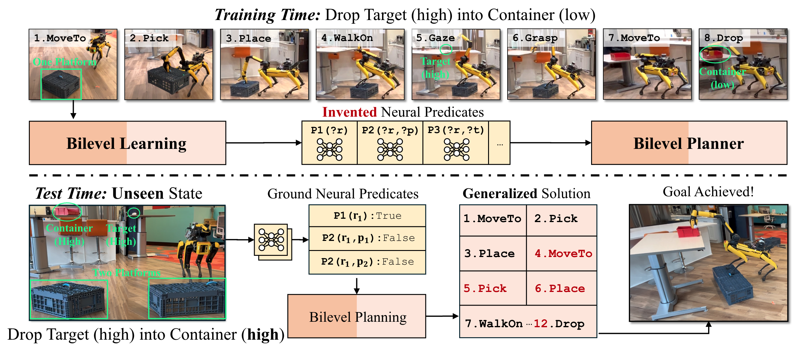

# Bilevel Learning for Bilevel Planning

Bowen Li, Tom Silver, Sebastian Scherer, and Alex Gray

Published in **Robotics: Science and Systems 2025**.



## Abstract
A robot that learns from demonstrations should not just imitate what it sees---it should understand the high-level concepts that are being demonstrated and generalize them to new tasks.
Bilevel planning is a hierarchical model-based approach where predicates (relational state abstractions) can be leveraged to achieve compositional generalization.
However, previous bilevel planning approaches depend on predicates that are either hand-engineered or restricted to very simple forms, limiting their scalability to sophisticated, high-dimensional state spaces.
To address this limitation, we present IVNTR, the first bilevel planning approach capable of learning neural predicates directly from demonstrations.
Our key innovation is a neuro-symbolic bilevel learning framework that mirrors the structure of bilevel planning.
In IVNTR, symbolic learning of the predicate "effects" and neural learning of the predicate "classifiers" alternate, with each providing guidance for the other.
We evaluate IVNTR in six diverse robot planning domains, demonstrating its effectiveness in abstracting various continuous and high-dimensional states.
While most existing approaches struggle to generalize (with $<35\%$ success rate), our IVNTR achieves an average success rate of $77\%$ on unseen tasks.
Additionally, we showcase IVNTR on a mobile manipulator, where it learns to perform real-world mobile manipulation tasks and generalizes to unseen test scenarios that feature new objects, new states, and longer task horizons.
Our findings underscore the promise of learning and planning with abstractions as a path towards high-level generalization.

## Installation
This repo is heavily based on [predicators](https://github.com/Learning-and-Intelligent-Systems/predicators), so similar installation would apply here.

- From scratch
    ```
    git clone https://github.com/Jaraxxus-Me/IVNTR.git
    git submodule update --init --recursive
    conda create -n ivntr python=3.8.10
    cd IVNTR
    pip install -e .
    # We have used torch 2.1.2 on CUDA 12.1 machine, but this should be flexible
    pip install torch==2.1.2 torchvision==0.16.2 torchaudio==2.1.2 --index-url https://download.pytorch.org/whl/cu121
    # Install FastDownward, following their instructions if anything goes wrong
    cd ext/downward
    python build.py
    mkdir saved_approaches saved_datasets logs
    ```
    If you want to run the blocks point cloud environment, follow instructions here to compile pytorch3d on your machine.
    Otherwise, simply use pip install
    ```
    pip install pytorch3d
    ```

- Using docker (not verified)
    ```
    docker pull bowenli1024/predicators:v0
    ```

## Test Invented Predicates

- [ ] Verify them on local machine

1. Download the pre-trained models [here](https://drive.google.com/file/d/1hOb776_weRpD6wkS5mBnGmkPLwrEXGku/view?usp=sharing), extract them in `IVNTR/saved_approaches`. Download all of our experiment log files [here](https://drive.google.com/file/d/1rZJZE3sQvucGBK7TUdSgmkYvP7fLooro/view?usp=drive_link) (for verifying the reproduction).
    ```
    IVNTR/
    ├── saved_approaches/
    │   ├── open_models/
    │   │   ├── satellites/
    │   │   │   ├── ivntr_0/
    │   │   ├── view_plan_hard/
    │   │   ├── ...
    ```
2. Understand the mapping of the env names `->` those in the paper, Table I:
    ```
    satellites -> Satellites
    blocks_pos -> Blocks
    view_plan_trivial -> Measure-Mul
    view_plan_hard -> Climb-Measure
    pickplace_stair -> Climb-Transport
    blocks_pcd -> Engrave
    ```
3. Select a test script in `scripts/test` to plan with the invented (and selected) neural predicates.

    For example, testing the satellites domain:
    ```
    bash scripts/test/satellites/satellites_ivntr.sh
    ```
    You will notice that the script will automatically create training demonstrations and test tasks in `saved_datasets`.
    This may take a while.
    You should expect outputs like this (also see our log files `final/satellites/sim/ivntr_ood_0.log`):
    ```
    ...
    Task 50 / 50: SOLVED
    Tasks solved: 47 / 50
    Average time for successes: 0.56207 seconds
    PER_TASK_task0_options_executed: 17.0
    PER_TASK_task1_options_executed: 18.0
    PER_TASK_task2_options_executed: 15.0
    PER_TASK_task3_options_executed: 14.0
    PER_TASK_task4_options_executed: 14.0
    PER_TASK_task5_options_executed: 20.0
    PER_TASK_task6_options_executed: 18.0
    PER_TASK_task7_options_executed: 17.0
    PER_TASK_task9_options_executed: 17.0
    PER_TASK_task10_options_executed: 16.0
    PER_TASK_task11_options_executed: 13.0
    PER_TASK_task12_options_executed: 12.0
    PER_TASK_task13_options_executed: 13.0
    PER_TASK_task14_options_executed: 22.0
    ...
    ```
4. A detailed explanation of the pre-trained folders

    `ivntr_0/neural_b_p3`: ALL of the neural weights for invented predicate group `b_p3(?sat,?obj)` during one tree expansion.

    `ivntr_0/xxxx.saved.json`: The information about SELECTED predicates and the operators constructed from them. In the `.sh` files, the flag `load_neupi_from_json` will try to use this file.

    `ivntr_0/xxxx.saved.neupi_info`: Some legacy info generated, but it is hardware dependent.

    `ivntr_0/xxxx.saved.init_atom_traj`: Useless.

5. Other baselines in TABLE I

    You can also play with other baselines by following the `.sh` files in `scripts/test/satellites`. But they will need to be re-trained. Since we use the same samplers as our bilevel planner, you will need to first re-learn IVNTR following the next section.


## Inventing Neural Predicates from Demonstration
There are two optional predicate invention pipelines and they are used in different domains.

### Inventing ALL groups of predicates in a single run.

This works for small scale domains such as `satellites`, `blocks`, `viewplan`.
For example, to invent predicates for `satellites`, run:
```
bash scripts/train/satellites/satellites_biplan.sh
```
Some important configures:
- `predicators/config/satellites/pred.yaml`: Specifies the learning configurations for each group (make sure not to skip any of the predicates if not resumed).

- `--neupi_save_path`: Defines where the predicates will be stored.

- `--domain_aaai_thresh`: Defines the threshold to stop predicate selection.

Test will start by default right after training.

### Inventing each groups of predicates in parallel multiple runs.

This works for large scale domains such as `engrave`, `pickplace_stair`.
For example, to invent predicates for `pickplace_stair`, do the following in sequence:

0. Collect demonstration data:
    We will use an `oracle` bilevel planner to collect deomonstrations, e.g.,
    ```
    scripts/train/pickplace_stair/collect_data_0.sh
    ```
    Note that:
    - Use `--sesame_task_planner 'fdopt'`.

    - The data will be saved to `saved_datasets`

    - After this, use `--load_data` in the following steps.

1. Invent individual groups:
    ```
    bash scripts/train/pickplace_stair/pickplace_biplan_up12.sh # on GPU0
    bash scripts/train/pickplace_stair/pickplace_biplan_bp3.sh # on GPU1
    bash scripts/train/pickplace_stair/pickplace_biplan_bp4.sh # on GPU2
    bash scripts/train/pickplace_stair/pickplace_biplan_bp5.sh # on GPU3
    ...
    ```
    Note that:
    - For each run, we have only used part of the predicate learning configuration. E.g., `predicators/config/pickplace_stair/pred_up12.yaml` is just part of `predicators/config/pickplace_stair/pred_all.yaml`.

    - You can kill each run after the invention is done. You can know this from the logging:
        ```
        Neural Predicate Invention Done in xxx seconds.
        ```
        Once you see this line, kill the run.
    
2. Search the complete predicate pool:
    ```
    bash scripts/train/pickplace_stair/pickplace_biplan_search.sh
    ```
    Note that:
    - Here we used `predicators/config/pickplace_stair/pred_all.yaml`, where all groups are skipped, `skip_train: True`.

    - In ths `.sh` file, we used `--neupi_load_pretrained` instead of `--neupi_save_path` in step 1. But the two directories are the same.

    - After this step, you will notice that there will be an additional file named `xxx.neupi_info` in the `--neupi_load_pretrained` directory. This stores (1) the selected predicates and the operator and (2) the learned sampler for each operator. A good way to interprete it would be using this file:
        ```
        python3 scripts/biplan_pkl2json.py # replace the file path
        ```
        This generates the `.json` file we have used in the previous test section.
        `.json` file does not store the learned samplers since they are neural generators, but samplers will be saved as `.pt` files and can be loaded with this flag `neupi_gt_sampler`. Detail see L2467 in `predicators/approaches/bilevel_learning_approach.py`.


## Reference
If you used our work in your research, or you find our work useful, please cite us as:
```
@INPROCEEDINGS{Li2025IVNTR,     
  title={{Bilevel Learning for Bilevel Planning}},
  author={Li, Bowen and Silver, Tom and Scherer, Sebastian and Gray, Alexander}, 
  booktitle={Proceedings of the Robotics: Science and Systems (RSS)}, 
  year={2025},
  volume={},
  number={}
}
```
